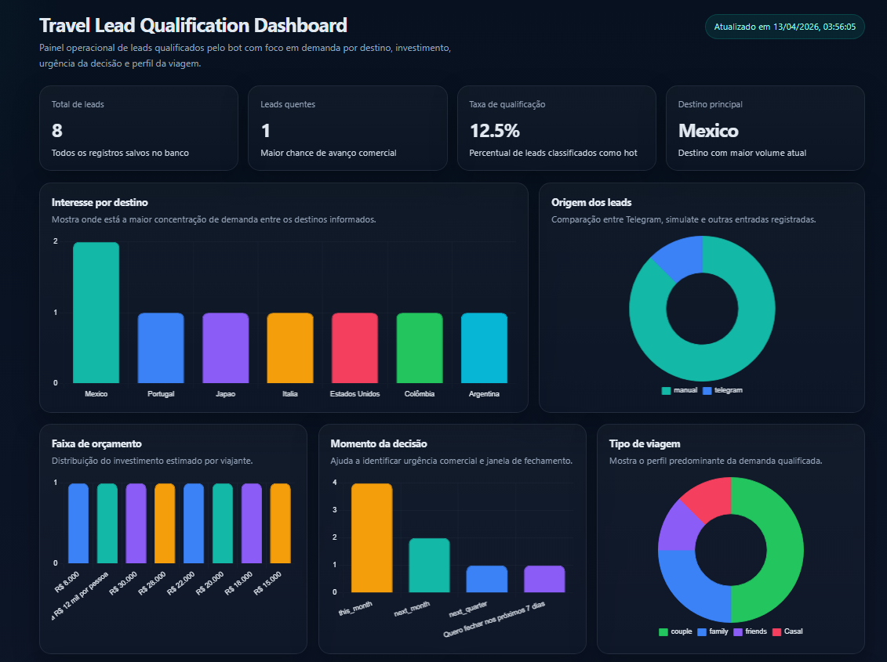

# Travel Lead Qualification MVP

A conversational lead qualification system for travel agencies, built with FastAPI and Telegram Bot API. Leads are captured through a structured conversation flow, qualified automatically, persisted in a database, and monitored through an operational dashboard.

> **Note on channel decision:** This project was originally designed around WhatsApp Cloud API. After identifying that Meta Business account approval would block the delivery timeline, the integration layer was migrated to Telegram, which offers an open API with no approval gate. The qualification engine, persistence layer, dashboard, and all business logic remain identical. In a production scenario, swapping the channel back to WhatsApp is an isolated change in the integration layer only.

---

## Live Demo

| | |
|---|---|
| Dashboard | https://travel-mvp-production-a93a.up.railway.app/dashboard |
| API Docs | https://travel-mvp-production-a93a.up.railway.app/docs|
| Health | https://travel-mvp-production-a93a.up.railway.app |
| Telegram Bot | https://t.me/travel_qualification_demo_bot |

---

## Stack

| Layer | Technology |
|---|---|
| Backend | Python · FastAPI |
| Conversation AI | Anthropic Claude API (qualification engine) |
| Messaging channel | Telegram Bot API |
| Persistence | SQLite |
| Dashboard | Jinja2 · Chart.js |
| Config | python-dotenv |
| Deploy | Railway |

---

## Architecture

```
Telegram user
     │
     ▼
POST /api/telegram/webhook   ← Telegram delivers message
     │
     ▼
qualification.py             ← Conversation state machine
     │                          powered by Claude API
     ▼
db.py (SQLite)               ← Lead persisted with temperature score
     │
     ▼
GET /api/metrics             ← Aggregated metrics
     │
     ▼
GET /dashboard               ← Operational dashboard (Chart.js)
```

---

## Product Flow

1. User sends `/start` to the Telegram bot
2. The bot walks through a structured qualification conversation — destination, travel period, group size, budget, trip type, decision timing, and priorities
3. At the end of the flow, Claude classifies the lead temperature: `hot`, `warm`, or `cold`
4. The qualified lead is persisted in SQLite with a full notes summary
5. The dashboard displays real-time KPIs and charts for the commercial team

---

## Features

- Conversational lead intake via Telegram bot
- AI-powered lead temperature scoring (`hot` / `warm` / `cold`)
- SQLite persistence with structured qualification fields
- REST API with `/api/metrics` for dashboard consumption
- Operational dashboard with Chart.js visualizations: leads by destination, budget, source, trip type, decision timing, and priority focus
- `POST /api/simulate` endpoint for testing the qualification flow without Telegram
- `POST /api/leads` for manual lead creation
- Telegram bot token validation via `/api/telegram/test`

---

## Dashboard



---

## Qualification Fields

Each qualified lead captures:

| Field | Description |
|---|---|
| `destination_country` | Target country |
| `destination_city` | Specific city or region |
| `travel_period_text` | Travel period in natural language |
| `travelers_count` | Number of travelers |
| `trip_type` | e.g. couple, family, solo, group |
| `budget_range` | Budget range informed by the lead |
| `decision_timing` | How soon they plan to decide |
| `priority_focus` | What matters most: price, comfort, experience |
| `lead_temperature` | `hot` / `warm` / `cold` — AI classification |
| `lead_source` | `telegram`, `simulate`, or `manual` |
| `notes_summary` | Full structured summary generated at qualification |

---

## API Routes

| Method | Route | Description |
|---|---|---|
| `GET` | `/` | Health check |
| `GET` | `/dashboard` | Operational dashboard (HTML) |
| `GET` | `/api/metrics` | Aggregated lead metrics (JSON) |
| `POST` | `/api/leads` | Create a lead manually |
| `POST` | `/api/simulate` | Simulate a qualification conversation |
| `POST` | `/api/telegram/webhook` | Receive Telegram messages |
| `GET` | `/api/telegram/test` | Validate Telegram bot token |
| `GET` | `/api/telegram/updates` | Fetch raw Telegram updates |
| `GET` | `/api/telegram/send-test` | Send a test message via Telegram |

---

## Simulate Endpoint — No Telegram Required

You can test the full qualification flow without a Telegram setup:

**Start the conversation:**
```bash
curl -X POST https://travel-mvp-production-a93a.up.railway.app/api/simulate \
  -H "Content-Type: application/json" \
  -d '{"phone": "+5511999990001", "message": "start", "session": null}'
```

**Continue with responses, passing the session back each turn:**
```bash
curl -X POST https://travel-mvp-production-a93a.up.railway.app/api/simulate \
  -H "Content-Type: application/json" \
  -d '{
    "phone": "+5511999990001",
    "message": "Cancun",
    "session": {"state": "ask_destination", "lead": {}}
  }'
```

**Example completed response:**
```json
{
  "reply": "Perfect. I qualified this opportunity as a warm lead for Cancun (Mexico).",
  "session": {
    "state": "done",
    "lead": {
      "destination_city": "Cancun",
      "destination_country": "Mexico",
      "travel_period_text": "July",
      "travelers_count": 2,
      "budget_range": "20k",
      "trip_type": "couple",
      "lead_temperature": "warm"
    }
  },
  "completed": true
}
```

---

## Running Locally

```bash
git clone https://github.com/Padilhaaaaa/travel-mvp.git
cd travel-mvp

python -m venv venv
# Mac/Linux:
source venv/bin/activate
# Windows:
venv\Scripts\activate

pip install -r requirements.txt

cp .env.example .env
# Edit .env with your credentials

uvicorn app.main:app --reload
```

The app will be available at `http://localhost:8000`.
Interactive API docs at `http://localhost:8000/docs`.

---

## Deploying to Railway

This project is ready to deploy on [Railway](https://railway.app) with zero configuration.

1. Fork or clone this repo
2. Create a new project on Railway and connect your GitHub repo
3. Add environment variables in the Railway dashboard
4. Railway detects the `Procfile` and deploys automatically

```
web: uvicorn app.main:app --host 0.0.0.0 --port $PORT
```

After deploy, register the Telegram webhook:

```bash
curl "https://api.telegram.org/bot<YOUR_TOKEN>/setWebhook?url=https://<YOUR_URL>.up.railway.app/api/telegram/webhook"
```

---

## Environment Variables

```env
TELEGRAM_BOT_TOKEN=your_bot_token_here
ANTHROPIC_API_KEY=your_anthropic_key_here
TELEGRAM_CHAT_ID=your_chat_id_here       # optional, for send-test route
DB_PATH=travel_mvp.db
APP_ENV=development
```

To get a Telegram bot token: open [@BotFather](https://t.me/BotFather) on Telegram, send `/newbot`, and follow the instructions.

---

## Project Structure

```
travel-mvp/
├── app/
│   ├── main.py               # FastAPI app, routes, Telegram webhook handler
│   ├── db.py                 # SQLite connection, schema, insert_lead
│   ├── services/
│   │   └── qualification.py  # Conversation state machine + Claude integration
│   └── templates/
│       └── dashboard.html    # Operational dashboard (Jinja2 + Chart.js)
├── .env.example
├── .gitignore
├── Procfile                  # Railway deploy config
├── requirements.txt
└── README.md
```

---

## What I Would Add in a Production Version

- Replace SQLite with PostgreSQL + pgvector for semantic lead search
- Add webhook signature verification (Telegram `X-Telegram-Bot-Api-Secret-Token`)
- Persistent session storage (Redis) instead of in-memory dict
- Authentication layer for the dashboard
- WhatsApp Cloud API as primary channel (drop-in swap for the Telegram layer)
- CI/CD pipeline and Docker Compose for local parity with production
